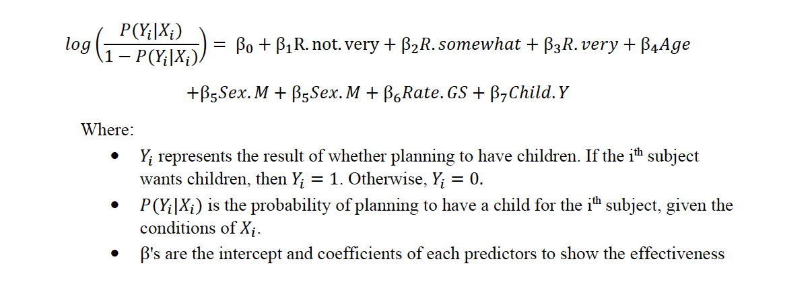

```{r setup, include=FALSE}
knitr::opts_chunk$set(echo = F)
```

# Abstract
Nowadays, a significant decrease of fertility rate has shown in many countries. This report uses the 2017 Canadian General Social Survey (GSS) to propose a logistic regression model on fertility intentions using survey estimation. The model has shown that fertility intentions and extreme feelings toward religiosity have intimate connection with the control of other covariates. People who describe religion as “extremely important” tend to have higher fertility intentions compared to people for whom religion is “not important at all”. This result can be caused by complicated reasons such as religious family ideology, different perspectives in importance of family, parent’s attitudes, and the acceptance of non-marital sex relations.

# Introduction

A study by Sarah R. Hayford and S. Philip Morgan in the US has shown that women who report that religion as “very important” have a higher fertility rate or higher intending fertility rate than women who consider religion as “somewhat important” or “not important”. Due to this study in the US, we want to explore more about the relationship between religiosity and fertility intention in Canada using survey estimation from the data provided by Statistic Canada to see if the results are similar. A potential logistic model was built between religion, fertility rate and some other covariates to examine the connection. By controlling multiple covariates.as we increase the importance of religion, the probability of fertility intention also increases by a significant number. This report will also discuss how the data was collected along with some weakness and strength of this approach method and the model constructed. 

# Data

Our data is retrieved from the GSS 2017 dataset. After the cleaning and variable adjusting process, it contains 5141 observations with six variables. All the missing values and meaningless responses, such as unsure, skip, and do not know, are omitted since they do not contribute to our analysis. \

The six variables contain the aspects of a subject’s: \

1.	the intention of children in the future (Yes or No) \
2.	importance of religious belief (Not at all, Not very, Somewhat, or Very)  \
3.	age (ranged from 15 to 59, with 21 as the mean) \
4.	sex (Male or Female) \
5.	self-rate of life quality (Bad/Average, Good/Superb) \
6.	whether the subject has a child before (Yes or No) \


```{r,include=FALSE}
#### Workspace set-up ####
library(janitor)
library(tidyverse)
library(pROC)
# Load the data dictionary and the raw data and correct the variable names
raw_data <- read.csv("AAOEq7Sk.csv")
dict <- read_lines("gss_dict.txt", skip = 18) # skip is because of preamble content
# Now we need the labels because these are the actual responses that we need
labels_raw <- read_file("gss_labels.txt")


#### Set-up the dictionary ####
# What we want is a variable name and a variable definition
variable_descriptions <- as_tibble(dict) %>% 
  filter(value!="}") %>% 
  mutate(value = str_replace(value, ".+%[0-9].*f[ ]{2,}", "")) %>% 
  mutate(value = str_remove_all(value, "\"")) %>% 
  rename(variable_description = value) %>% 
  bind_cols(tibble(variable_name = colnames(raw_data)[-1]))
 
# Now we want a variable name and the possible values
labels_raw_tibble <- as_tibble(str_split(labels_raw, ";")[[1]]) %>% 
  filter(row_number()!=1) %>% 
  mutate(value = str_remove(value, "\nlabel define ")) %>% 
  mutate(value = str_replace(value, "[ ]{2,}", "XXX")) %>% 
  mutate(splits = str_split(value, "XXX")) %>% 
  rowwise() %>% 
  mutate(variable_name = splits[1], cases = splits[2]) %>% 
  mutate(cases = str_replace_all(cases, "\n [ ]{2,}", "")) %>%
  select(variable_name, cases) %>% 
  drop_na()

# Now we have the variable name and the different options e.g. age and 0-9, 10-19, etc.
labels_raw_tibble <- labels_raw_tibble %>% 
  mutate(splits = str_split(cases, "[ ]{0,}\"[ ]{0,}"))

# The function sets up the regex (I know, I know, but eh: https://xkcd.com/208/)
add_cw_text <- function(x, y){
  if(!is.na(as.numeric(x))){
    x_new <- paste0(y, "==", x,"~")
  }
  else{
    x_new <- paste0("\"",x,"\",")
  }
  return(x_new)
}

# The function will be in the row, but it'll get the job done
cw_statements <- labels_raw_tibble %>% 
  rowwise() %>% 
  mutate(splits_with_cw_text = list(modify(splits, add_cw_text, y = variable_name))) %>% 
  mutate(cw_statement = paste(splits_with_cw_text, collapse = "")) %>% 
  mutate(cw_statement = paste0("case_when(", cw_statement,"TRUE~\"NA\")")) %>% 
  mutate(cw_statement = str_replace(cw_statement, ",\"\",",",")) %>% 
  select(variable_name, cw_statement)
# So for every variable we now have a case_when() statement that will convert 
# from the number to the actual response.

# Just do some finally cleanup of the regex.
cw_statements <- 
  cw_statements %>% 
  mutate(variable_name = str_remove_all(variable_name, "\\r")) %>% 
  mutate(cw_statement = str_remove_all(cw_statement, "\\r"))


#### Apply that dictionary to the raw data ####
# Pull out a bunch of variables and then apply the case when statement for the categorical variables
gss <- raw_data %>% 
  select(CASEID, 
         agedc, 
         achd_1c, 
         achdmpl, 
         totchdc, 
         acu0c,
         agema1c,
         achb1c,
         rsh_131a,
         arretwk,
         slm_01, 
         sex, 
         brthcan, 
         brthfcan,
         brthmcan,
         brthmacr,
         brthprvc,
         yrarri,
         prv, 
         region, 
         luc_rst, 
         marstat, 
         amb_01, 
         vismin, 
         alndimmg,
         bpr_16, 
         bpr_19,
         ehg3_01b, 
         odr_10, 
         livarr12, 
         dwelc, 
         hsdsizec,
         brthpcan,
         brtpprvc, 
         visminpr,
         rsh_125a, 
         eop_200,
         uhw_16gr,
         lmam_01, 
         acmpryr,
         srh_110,
         srh_115,
         religflg, 
         rlr_110,
         lanhome, 
         lan_01,
         famincg2, 
         ttlincg2, 
         noc1610, 
         cc_20_1,
         cc_30_1,
         ccmoc1c,
         cor_031,
         cor_041,
         cu0rnkc,
         pr_cl,
         chh0014c,
         nochricc,
         grndpa,
         gparliv,
         evermar,
         ma0_220,
         nmarevrc,
         ree_02,
         rsh_131b,
         rto_101,
         rto_110,
         rto_120,
         rtw_300,
         sts_410,
         csp_105,
         csp_110a,
         csp_110b,
         csp_110c,
         csp_110d,
         csp_160,
         fi_110) %>% 
  mutate_at(vars(agedc:fi_110), .funs = funs(ifelse(.>=96, NA, .))) %>% 
  mutate_at(.vars = vars(sex:fi_110),
            .funs = funs(eval(parse(text = cw_statements %>%
                                      filter(variable_name==deparse(substitute(.))) %>%
                                      select(cw_statement) %>%
                                      pull()))))

# Fix the names
gss <- gss %>% 
  clean_names() %>% 
  rename(age = agedc,
         age_first_child = achd_1c,
         age_youngest_child_under_6 = achdmpl,
         total_children = totchdc,
         age_start_relationship = acu0c,
         age_at_first_marriage = agema1c,
         age_at_first_birth = achb1c,
         distance_between_houses = rsh_131a,
         age_youngest_child_returned_work = arretwk,
         feelings_life = slm_01,
         sex = sex,
         place_birth_canada = brthcan,
         place_birth_father = brthfcan,
         place_birth_mother = brthmcan,
         place_birth_macro_region = brthmacr,
         place_birth_province = brthprvc,
         year_arrived_canada = yrarri,
         province = prv,
         region = region,
         pop_center = luc_rst,
         marital_status = marstat,
         aboriginal = amb_01,
         vis_minority = vismin,
         age_immigration = alndimmg,
         landed_immigrant = bpr_16,
         citizenship_status = bpr_19,
         education = ehg3_01b,
         own_rent = odr_10,
         living_arrangement = livarr12,
         hh_type = dwelc,
         hh_size = hsdsizec,
         partner_birth_country = brthpcan,
         partner_birth_province = brtpprvc,
         partner_vis_minority = visminpr,
         partner_sex = rsh_125a,
         partner_education = eop_200,
         average_hours_worked = uhw_16gr,
         worked_last_week = lmam_01,
         partner_main_activity = acmpryr,
         self_rated_health = srh_110,
         self_rated_mental_health = srh_115,
         religion_has_affiliation = religflg,
         religion_importance = rlr_110,
         language_home = lanhome,
         language_knowledge = lan_01,
         income_family = famincg2,
         income_respondent = ttlincg2,
         occupation = noc1610,
         childcare_regular = cc_20_1,
         childcare_type = cc_30_1,
         childcare_monthly_cost = ccmoc1c,
         ever_fathered_child = cor_031,
         ever_given_birth = cor_041,
         number_of_current_union = cu0rnkc,
         lives_with_partner = pr_cl,
         children_in_household = chh0014c,
         number_total_children_intention = nochricc,
         has_grandchildren = grndpa,
         grandparents_still_living = gparliv,
         ever_married = evermar,
         current_marriage_is_first = ma0_220,
         number_marriages = nmarevrc,
         religion_participation = ree_02,
         partner_location_residence = rsh_131b,
         full_part_time_work = rto_101,
         time_off_work_birth = rto_110,
         reason_no_time_off_birth = rto_120,
         returned_same_job = rtw_300,
         satisfied_time_children = sts_410,
         provide_or_receive_fin_supp = csp_105,
         fin_supp_child_supp = csp_110a,
         fin_supp_child_exp = csp_110b,
         fin_supp_lump = csp_110c,
         fin_supp_other = csp_110d,
         fin_supp_agreement = csp_160,
         future_children_intention = fi_110) 

#### Clean up ####
gss <- gss %>% 
  mutate_at(vars(age:future_children_intention), 
            .funs = funs(ifelse(.=="Valid skip"|.=="Refusal"|.=="Not stated", "NA", .))) 

gss <- gss %>% 
  mutate(is_male = ifelse(sex=="Male", 1, 0)) 

gss <- gss %>% 
  mutate_at(vars(fin_supp_child_supp:fin_supp_other), .funs = funs(case_when(
    .=="Yes"~1,
    .=="No"~0,
    .=="NA"~as.numeric(NA)
  )))

main_act <- raw_data %>% 
  mutate(main_activity = case_when(
    mpl_105a=="Yes"~ "Working at a paid job/business",
    mpl_105b=="Yes" ~ "Looking for paid work",
    mpl_105c=="Yes" ~ "Going to school",
    mpl_105d=="Yes" ~ "Caring for children",
    mpl_105e=="Yes" ~ "Household work", 
    mpl_105i=="Yes" ~ "Other", 
    TRUE~ "NA")) %>% 
  select(main_activity) %>% 
  pull()

age_diff <- raw_data %>% 
  select(marstat, aprcu0c, adfgrma0) %>% 
  mutate_at(.vars = vars(aprcu0c:adfgrma0),
            .funs = funs(eval(parse(text = cw_statements %>%
                                      filter(variable_name==deparse(substitute(.))) %>%
                                      select(cw_statement) %>%
                                      pull())))) %>% 
  mutate(age_diff = ifelse(marstat=="Living common-law", aprcu0c, adfgrma0)) %>% 
  mutate_at(vars(age_diff), .funs = funs(ifelse(.=="Valid skip"|.=="Refusal"|.=="Not stated", "NA", .))) %>% 
  select(age_diff) %>% 
  pull()

gss <- gss %>% mutate(main_activity = main_act, age_diff = age_diff)

# Change some from strings into numbers
gss <- gss %>% 
  rowwise() %>% 
  mutate(hh_size = str_remove(string = hh_size, pattern = "\\ .*")) %>% 
  mutate(hh_size = case_when(
    hh_size=="One" ~ 1,
    hh_size=="Two" ~ 2,
    hh_size=="Three" ~ 3,
    hh_size=="Four" ~ 4,
    hh_size=="Five" ~ 5,
    hh_size=="Six" ~ 6
  )) 

gss <- gss %>% 
  rowwise() %>% 
  mutate(number_marriages = str_remove(string = number_marriages, pattern = "\\ .*")) %>% 
  mutate(number_marriages = case_when(
    number_marriages=="No" ~ 0,
    number_marriages=="One" ~ 1,
    number_marriages=="Two" ~ 2,
    number_marriages=="Three" ~ 3,
    number_marriages=="Four" ~ 4
  )) 

gss <- gss %>% 
  rowwise() %>% 
  mutate(number_total_children_known = ifelse(number_total_children_intention=="Don't know"|number_total_children_intention=="NA", 0, 1)) %>% 
  mutate(number_total_children_intention = str_remove(string = number_total_children_intention, pattern = "\\ .*")) %>% 
  mutate(number_total_children_intention = case_when(
    number_total_children_intention=="None" ~ 0,
    number_total_children_intention=="One" ~ 1,
    number_total_children_intention=="Two" ~ 2,
    number_total_children_intention=="Three" ~ 3,
    number_total_children_intention=="Four" ~ 4,
    number_total_children_intention=="Don't" ~ as.numeric(NA)
  )) 

write_csv(gss, "gss.csv")
```


```{r,include=FALSE}
glimpse(gss)
```


```{r,include=FALSE}
data_needed <- gss %>% select(future_children_intention,age,sex,feelings_life,
                              total_children,province, 
                       religion_importance,
                      income_family)
data_needed$future_children_intention <- 
  factor(data_needed$future_children_intention)
data_needed$age <- data_needed$age - 15
data_needed$sex <- factor(data_needed$sex)
data_needed$feelings_life <- factor(data_needed$feelings_life)
data_needed$total_children <- factor(data_needed$total_children)
data_needed$province <- factor(data_needed$province)
data_needed$religion_importance <- factor(data_needed$religion_importance)
data_needed$income_family <- factor(data_needed$income_family)
glimpse(data_needed)
```


```{r,include=FALSE}
data_needed<-na.omit(data_needed)
glimpse(data_needed)
```


```{r,include=FALSE}

removed_obs_in_response <- which(data_needed$future_children_intention == 
                                   "Don't know"| 
        data_needed$future_children_intention == "NA"|
        data_needed$future_children_intention == "Unsure")


removed_obs_in_religion_importance <- which(data_needed$religion_importance == 
                                              "Don't know"| 
        data_needed$religion_importance == "NA")

removed_obs_all <- unique(c(removed_obs_in_response,
                            removed_obs_in_religion_importance))

```

```{r,include=FALSE}
data_needed <- data_needed[-c(removed_obs_all),]
glimpse(data_needed)
```


```{r,include=FALSE}
data_needed$future_children_intention <- 
  ifelse(data_needed$future_children_intention == "Probably yes" |
           data_needed$future_children_intention == "Definitely yes","Yes", 
         "No")

data_needed$feelings_life <- 
  ifelse(data_needed$feelings_life == "1"|
           data_needed$feelings_life == "2"|
           data_needed$feelings_life == "3"|
           data_needed$feelings_life == "4"|
           data_needed$feelings_life == "5","Bad/Avg","Good/Superb")
data_needed$total_children <- 
  ifelse(data_needed$total_children == "0","No", "Yes")
data_needed <- data_needed %>% 
  rename(ever_have_child = total_children)
data_needed <- data_needed %>% 
  rename(want_child = future_children_intention)
data_needed <- data_needed %>% 
  rename(religion = religion_importance)
glimpse(data_needed)

```

```{r,include=FALSE}
data_needed$want_child <- 
  factor(data_needed$want_child)
data_needed$feelings_life <- factor(data_needed$feelings_life)
data_needed$ever_have_child <- factor(data_needed$ever_have_child)
data_needed$religion <- factor(data_needed$religion)
```


```{r,include=FALSE}
set.seed(1004070346)
mydata <-data_needed[,-c(6,8)]
sample80 <- sample(1:6427, floor(0.8*nrow(mydata)), replace=FALSE)
train_data <- mydata[sample80,]
test_data <- mydata[-sample80,]
glimpse(train_data)
```
```{r,include=FALSE}
summary(mydata$age)
```

```{r,}
ggplot(data = mydata, aes(x=religion))+geom_bar(aes(fill=want_child), 
                                                     width = 0.5)+ 
  theme(axis.text.x = element_text(angle=45,vjust=0.6)) + 
  labs(title="Figure 1", 
       subtitle="Histogram on Religion, with outcome of our interest") 
```


```{r,include=FALSE}
## Survey Estimation for Logistic Regression
n=length(train_data$want_child)
N=30538825

#install.packages("survey")
library(survey)
## Using the Survey Library
fpc_srs = rep(N, n)

svy.design <- svydesign(id=~1, data=train_data, fpc=fpc_srs)

svyglm_mod <- svyglm(want_child ~ religion+age + sex + 
                     feelings_life + ever_have_child,
                   svy.design, family="binomial")
summary(svyglm_mod)

```

From Figure 1, we can see that in each level of the religious belief, the frequencies of having no intention of children in the future are generally close, and the frequencies of having the intention are various. However, Figure 1 does not have any other influencing factors included. We cannot give a proper justification of what we study based on this plot. Thus, the variables listed above from the 3rd to the 6th ones are considered as confounder variables. They are believed to have an influence on both the intention of children and the importance of religious belief. \
Some potential drawbacks of the data are many of the variables may have answering biases from the responders, the sample size may be large enough to represent the target population, and factors of each variables are restricted and may not be representative.


# Model
## Methods
The GSS dataset provides information about how many children are wanted in the future from the survey participants. This information is what we are interested in and is converted into a binary variable, as the response variable Y.  It indicates whether the outcome is to want children in the future. Thus, we propose a logistic regression model through R software to present the relationship between the response variable and the predictors. Due to the GSS was sampled based on different regions independently and aimed for the whole population in Canada as the target population, the infinite population correction and specifying the primary sampling unit is applied in the model through a survey design function in the survey package in R. The model is presented as the following:


## Model diagnose
We propose to use cross validation and the area under the curve (AUC) - receiver operating characteristics (ROC) curve – to perform the model diagnosis. In the cross validation, the data is divided into a training data to construct the model, containing 80% of the original data, and a testing data containing the rest data. The two statistic values of AUC are calculated for both training data and testing data. With a high value of AUC, it indicates that the model has a very good discriminate ability to distinguish the results between wanting a child and do not want a child.

# Results

```{r,include=FALSE}
knitr::kable(summary(svyglm_mod)$coef)
estimate <- summary(svyglm_mod)$coef
table <- cbind(exp(estimate[,1]),summary(svyglm_mod)$coef)
colnames(table)[1] = "Exponential.est"
```
```{r,include=FALSE}
knitr::kable(table,digits = 2, caption="Summary of Model")
```


```{r,include=FALSE}
## Discrimination with ROC curve ##

p_train <- predict(svyglm_mod, newdata = train_data, type = "response")

roc_logit_train <- roc(train_data$want_child ~ p_train)
## The True Positive Rate ##
TPR_train <- roc_logit_train$sensitivities
## The False Positive Rate ##
FPR_train <- 1 - roc_logit_train$specificities

```

```{r}

plot(FPR_train, TPR_train, xlim = c(0,1), ylim = c(0,1), type = 'l', lty = 1, 
     lwd = 2,col = 'red',main="Figure 2: AUC-ROC curve using training data")
abline(a = 0, b = 1, lty = 2, col = 'blue')
text(0.7,0.4,label = paste("AUC = ", round(auc(roc_logit_train),3)))

```


```{r,include=FALSE}
auc(roc_logit_train)
```


```{r,include=FALSE}
p_test <- predict(svyglm_mod, newdata = test_data, type = "response")

roc_logit_test <- roc(test_data$want_child ~ p_test)
## The True Positive Rate ##
TPR_test <- roc_logit_test$sensitivities
## The False Positive Rate ##
FPR_test <- 1 - roc_logit_test$specificities

```

```{r}
plot(FPR_test, TPR_test, xlim = c(0,1), ylim = c(0,1), type = 'l', 
     lty = 1, lwd = 2,col = 'red',main="Figure 2: AUC-ROC curve using testing data")
abline(a = 0, b = 1, lty = 2, col = 'blue')
text(0.7,0.4,label = paste("AUC = ", round(auc(roc_logit_test),3)))
```

```{r,include=FALSE}
auc(roc_logit_test)
```


# Discussion
## A brief introduction to GSS
The target population for the 2017 Canadian General Social Survey is all persons aged fifteen and above in Canada, excluding residents of the Yukon, Northwest Territories, and Nunavut, and full-time residents in institutions. From statistics generated by Statistics Canada, such target population size comes to a total of 30,538,825. The ten provinces of interest were divided into strata based on their geographic location, which means that the population was divided into non-overlapping subgroups accordingly. The ten provinces formed a total of 27 strata. \
The frame is a device from which a sample is drawn, which in this survey was a list of telephone numbers, where 86% of numbers were associated with one household, and the other 14% were not linked to any household. A simple random sample without replacement was performed in each stratum, which means that every member in each stratum has an equal probability of being chosen and can only be chosen once.	 \
All respondents were reached and interviewed by telephone. Several time periods were also set to be the best time to call interviewees. The selected interviewees who first refused to participate were re-contacted several times to explain the importance of the survey and were encouraged to participate. The overall response rate for this survey was 52.4%. 


## Strengths and weaknesses of GSS
By using a simple random sample without replacement, the results would be more accurate and unbiased. However, it is definitely expensive and time consuming to reach out to this many different people. The interview method, which is through telephone, is probably the easiest and the most efficient way to carry out the survey, and is probably the only way to get in contact with such a large sample spread widely in Canada. However, this can also cause problems: there is a high rate of interruption of the interview, respondents may have difficulties to provide personal information through the phone to a stranger. The repeated contact with a selected interviewee who first refused to do the survey helps to make every selected sample meaningful and helps to make the survey more complete, but its ethic issue should be questioned. The repeated contact may cause the interviewee’s resistance in doing the survey and disturbance of their regular life. \
Some missing information such as income and age where it can be found in Statistics Canada was imputed. Complete non-response households with no information available found in Statistics Canada were dropped.


## Discussion of model & model diagnose
From Table 1, we can see that the odds of planning to have children for a 15-year-old woman, who thinks religion is not important to her at all, does not feel good or superb about her life, and does not have a child before, is 6.58. As the age increases by one unit, the odds will decrease when controlling the other conditions. For the same woman mentioned above, if her religious belief becomes very important to her, the odds of planning to have children will be 117% higher. If the religion is not very important or somewhat important to her, the odds will be 25% and 20% higher, respectfully. However, we can only conclude that taking religions as a very important matter or as an absolutely not important matter is significantly associated with the response variable since both of their p-values are less than 0.05. To sum, we can see that when religious belief is extremely important, compared to not important at all, to a person, the person is more likely to plan to have children with the control of other covariates. \
From Figure 2, the AUC, equaling to 0.947, is calculated based on the training data for the model. It indicates that the model can distinguish between planning to have children and not planning to have children for a subject in the training data at 94.7% of the times. In other words, the model is well built. From Figure 3, instead of using the training data, the testing data is used for calculating the AUC value. The AUC, equaling to 0.95, indicates that at 95% of the times, the model can distinguish between planning to have children and not planning to have children for a subject. Thus, the prediction ability of the model is highly qualified.


## Weakness of model
The aspects covered by the model are limited. There might be other confounder variables which are more decisive but left out. Also, the sex variable here is limited only to males and females. It does not consider the diversity of sex identities.

## Discussion of conclusions 
The GSS was to gather data of general Canadians and to provide information on specific social issues of current or emerging interest. Results from Sarah R. Hayford and S. Philip Morgan’s study was examined using data from the GSS. Our built model agrees with the result that if religion is highly important to someone, their fertility intention will be very strong. However, one other interesting finding in this study that was not expected is that, for a person whose religion is not important at all to themselves, their fertility intention is also very strong, although not as strong as people who value their religion heavily. People who value their religion has not very important or somewhat important did not show a significant relationship between religiosity and fertility intention. The reasons for this result are yet to be discovered more deeply, But it could be that the people who believe their religion is very important to them are more traditional and want a traditional family. It also could be that people who have a traditional family value religion more heavily. 

## Next step
Increasing the sample size and collecting more data on relevant aspects are highly recommended to build a better model. Besides, the construction of the model is based on the GSS 2017 dataset only. It is recommended to use a different dataset from another year (from recent years) and study on the similar topic. Seeking the pattern among recent years can also be done for further investigation. 

# Appendix
## GitHub repo link


# References

1.Hayford, S. R., & Morgan, S. P. (2008). Religiosity and Fertility in the United States: The Role
of Fertility Intentions. Social forces; a scientific medium of social study and interpretation, 86(3), 1163–1188. https://doi.org/10.1353/sof.0.0000
 
2.Sam Firke (2020). janitor: Simple Tools for Examining and Cleaning Dirty Data. R package
version 2.0.1. https://CRAN.R-project.org/package=janitor
 
3.Statistics Canada. (n.d.). Retrieved from
https://www150.statcan.gc.ca/t1/tbl1/en/cv.action?pid=1710000501
 
 
4.T. Lumley (2020) "survey: analysis of complex survey samples". R package version 4.0.
 
5.Wickham et al., (2019). Welcome to the tidyverse. Journal of Open Source Software,
4(43), 1686, https://doi.org/10.21105/joss.01686
 
6.Xavier Robin, Natacha Turck, Alexandre Hainard, Natalia Tiberti, Frédérique Lisacek,
Jean-Charles Sanchez and Markus Müller (2011). pROC: an open-source package for R and S+ to analyze and compare ROC curves. BMC Bioinformatics, 12, p. 77.  DOI: 10.1186/1471-2105-12-77 <http://www.biomedcentral.com/1471-2105/12/77/>


